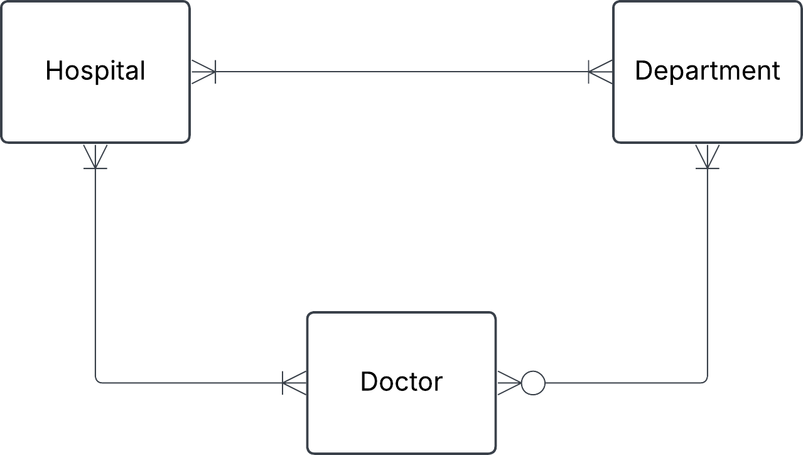
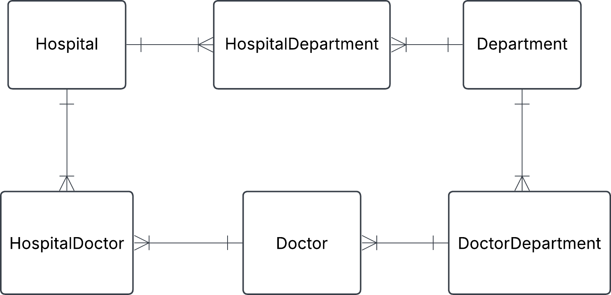
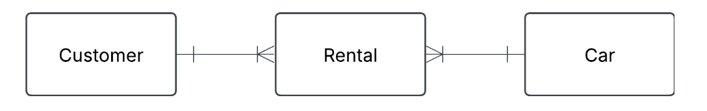
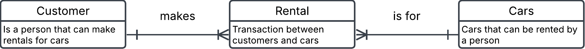
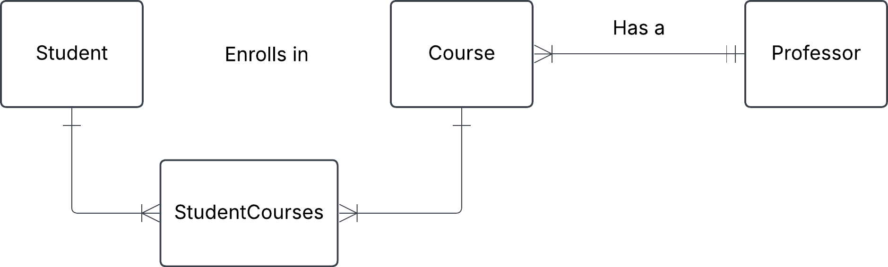
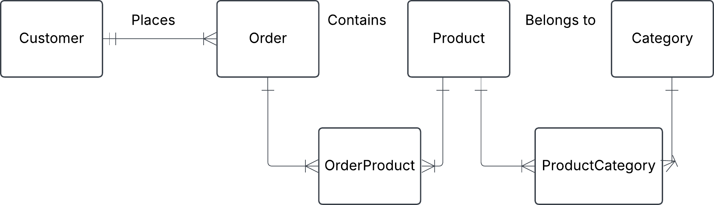

# Exercise 0

## 1. Hospital task

You have this json data, convert it into three tables: Hospital, Department and Doctor. Fill these tables with data. Do this manually and not programmatically.

```json
{
  "hospital": "Sjukhusstock",
  "address": "Drottninggatan 3, Stockholm",
  "departments": [
    {
      "name": "Kardiologi",
      "doctors": [
        { "id": 1, "name": "Dr. Abra Abrahamson" },
        { "id": 2, "name": "Dr. Erika Eriksson" }
      ]
    },
    {
      "name": "Neurologi",
      "doctors": [{ "id": 3, "name": "Dr. Sven Svensson" }]
    }
  ]
}
```

### Solution

- identify entities
- identify relationships and cardinalities
- create concetual ERD
- create tables

Initial naive ceonceptual ERD



**Initial tables**

Hospital

| hospital_id | name         | address          |
| ----------- | ------------ | ---------------- |
| 1           | Sjukhusstock | Drottninggatan 3 |

Department

| department_id | name       |
| ------------- | ---------- |
| 1             | Kardiologi |
| 2             | Neurologi  |

Doctor

| doctor_id | name                 |
| --------- | -------------------- |
| 1         | Dr. Abra Abrahamsson |
| 2         | Dr. Erika Eriksson   |
| 3         | Dr. Sven Svensson    |

Refined with bridge tables to reflect many-to-many relationships



HospitalDepartment

| hospital_department_id | hospital_id | department_id |
| ---------------------- | ----------- | ------------- |
| 1                      | 1           | 1             |
| 2                      | 1           | 2             |

HospitalDoctor

| hospital_doctor_id | doctor_id | hospital_id |
| ------------------ | --------- | ----------- |
| 1                  | 1         | 1           |
| 2                  | 2         | 1           |
| 3                  | 3         | 1           |

DepartmentDoctor

| department_doctor_id | doctor_id | department_id |
| -------------------- | --------- | ------------- |
| 1                    | 2         | 1             |
| 2                    | 2         | 1             |
| 3                    | 1         | 1             |

Test a join

Want information on Sjukhusstock and its departments

- hospital_department can join with department_id on department table and hospital_id on hospital_table
- query name from hospital table and name from department table

TODO: left for reader: create this SQL query


---

## 2. Library Bookly 

A library called Bookly keeps track of books and members who borrow them. Each book has a title, author, and ISBN number. Each member has a membership ID, name, and contact information. A member can borrow multiple books, but each book can be borrowed by only one member at a time.

a) Identify the entities and attributes for each entity.
 
 Solution: 
 
 **Book** 
- ISBN
- title
- author

> [!NOTE] 

> ISBN is a unique number for a book, which could be used as a `primary key`, this will make it into a `natural key`

 **Member**  
- membership_id
- first_name
- last_name
- phone
- address
- email

**Borrowing**
- borrowing_id 
- ISBN
- membership_id
- borrow_date
- return_date

 

b) Determine the relationship between member and books.
 
 Solution: 
- A Member can have zero, one or several Borrowing
- A Borrowing can be made by one and only one member
- A Borrowing is linked to one and only one Book
- A Book can be in 0, 1 or more Borrowing over time

c) Draw a conceptual ERD using crow foots notation.

Initial conceptual ERD
- 

<br>
Replaced many-to-many with a bridge table (composite entity)
- 

--- 

## 3. Conceptual ERD to words

This is an ERD conceptual diagram that a database designer and the business stakeholders agreed upon in a car rental company called Carent.



a) Describe the entities in this conceptual ERD.


b) Write out the relationship labels.


c) Describe the relationships between the entities (one-to-many, 

d) Define the relationship statement for example: "A Customer can have one or more Rentals".

### Solution 

a)

- Customer is a person that can make rentals for cars

- Car can be rented by person

- Rental (composite only) is a transaction between customers and cars

alternative to put in descriptions into the entitites directly in conceptual ERD



b) See image above

c) 
- Customer to Rental (one-to-many)
- Rental to Customer (many-to-one)
- Rental to Car (many-to-one)
- Car to Rental (one-to-many)

d)

- Each Customer makes one or more Rentals
- Each Rental is connected to one customer
- Each Rental is for one Car
- Each Car can be in several Rentals over time

---

## 4. Online store

You are designing a database for an online store that sells multiple products. Customers can place multiple orders, and each order contains multiple products.

a) Identify entities and their relationships

b) Create a conceptual ERD with cardinalities


---

## 5. University management system

A university needs a system to manage students, courses, and professors.

each student can enroll in multiple courses.
each course is taught by one professor.
a teacher can teach multiple courses.
a) Identify entities and their relationships

b) Come up with possible attributes for the entities
- Student = student_id, student_name
- Course = course_id, course_name
- Professor = professor_id, professor_name
- StudentCourses = student_id, course_id

c) Draw conceptual ERD with cardinalities

d) Define business rules (e.g. a student can enroll in max 4 courses)
If a course has 0 students the course is cancelled and therfore doesn't exist





## 6. Onshop

An e-commerce platform Onshop manages customers, orders, and products.

- a customer can place multiple orders.
- each order contains multiple products.
- a product can belong to multiple categories.

a) Identify key entities and their attributes (e.g., customer_name, order_date)

b) Sketch the conceptual ERD.

c) Define business rules



